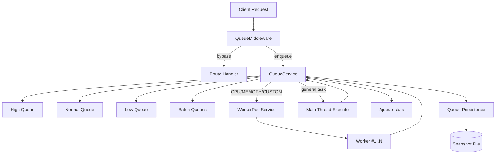

# nestjs-bulk-traffic-server

대용량 요청을 우선순위 큐로 흡수하고, CPU/메모리 집약 작업은 Worker Thread 풀로 오프로딩하는 NestJS 서버 골격입니다.

## 프로젝트 목적
- 트래픽 버스트 상황에서 요청을 즉시 실행하지 않고 큐에 적재해 안정적으로 처리
- 우선순위(high/normal/low)와 배치 처리로 처리량(throughput)과 응답 안정성 확보
- CPU/메모리 집약 작업을 Worker 풀로 분리해 메인 이벤트 루프 블로킹 완화
- 메모리 압박/큐 포화/타임아웃 상황에서 방어적으로 거부 및 정리

## 핵심 기능
- 전역 요청 큐잉 미들웨어 (`QueueMiddleware`)
- 3단계 우선순위 큐 + 배치 큐 (`QueueService`, `BatchService`)
- 메모리 압박 감지 및 저우선순위 선제 제거 (`MemoryService`)
- Worker Thread 풀 + 헬스체크 + 장애 워커 자동 교체 (`WorkerPoolService`)
- 큐 스냅샷 저장/복구(옵션, file strategy) (`PersistenceModule`)
- 운영 관측 엔드포인트 (`/health`, `/queue-stats`)

## 아키텍처 다이어그램


## 요청 처리 흐름
1. 모든 요청(health/queue-stats 제외)이 `QueueMiddleware`를 통과합니다.
2. 미들웨어가 `method + path + body`를 분석해 `priority/category/size/workloadType`을 계산합니다.
3. `QueueService.enqueue()`가 요청을 큐 또는 배치 큐에 적재합니다.
4. `QueueService`는 이벤트 기반(`setImmediate`)으로 우선순위 큐를 소진하고, 폴링(`QUEUE_PROCESS_INTERVAL_MS`)은 fallback으로 동작합니다.
5. 작업 유형이 `cpu/memory/custom`이면 Worker 풀로 전달하고, 아니면 메인 스레드에서 실행합니다.
6. 완료/실패/타임아웃 결과를 요청 단위로 resolve/reject 후 통계 누적합니다.

## 큐/워커 동작 규칙
- 우선순위: `priority >= 5 => high`, `>= 0 => normal`, `< 0 => low`
- 메모리 압박(`memoryPressure=true`) 시 low 큐 처리를 일시 중단
- 큐 대기 타임아웃: `QUEUE_TASK_TIMEOUT_MS`
- 작업 실행 타임아웃: `QUEUE_EXECUTION_TIMEOUT_MS`
- 큐 포화 시 즉시 거부: `QUEUE_OVERFLOW_THRESHOLD`
- Worker 풀은 타입별 동시성 제한 적용
  - `WORKER_MAX_CPU_CONCURRENCY`
  - `WORKER_MAX_MEMORY_CONCURRENCY`
  - `WORKER_MAX_CUSTOM_CONCURRENCY`
- 알 수 없는 workloadType은 일반 큐 fallback으로 처리하고 카운트(`workloadGeneralQueueFallbackCount`)에 누적

## 워커 엔진

`WORKER_ENGINE` 값으로 작업 실행 백엔드를 고릅니다. 목록 밖의 값을 넣으면 기본값으로 넘어가지 않고 부팅이 실패합니다.

| 값 | 상태 | 설명 |
|---|---|---|
| `node` (기본) | 동작 | Worker Thread 풀에서 실행. 워커 비활성 시 메인 스레드 처리 |
| `go` | 동작 | Go 사이드카(gRPC)로 위임. `GO_ENGINE_HOST`·`GO_ENGINE_PORT` 필요 |
| `both` | 동작 | Node·Go 비교 벤치마크(`/load-test/compare`) 전용 |
| `kafka` | **부분 구현** | 프로듀서 연결까지만. 아래 주의사항 참고 |

### `kafka` 모드 현재 상태

프로듀서는 실제로 브로커에 연결되고 `KAFKA_BROKERS` 검증도 부팅 시점에 걸리지만, **큐 처리 본류는 아직 이 백엔드를 거치지 않습니다.** 이 모드로 띄워도 작업은 Node 워커풀에서 처리되며 카프카로 발행되지 않습니다.

- 배선 여부는 `GET /queue-stats` 의 `engineBackendWired` 로 확인할 수 있습니다(현재 항상 `false`)
- 부팅 시 경고 로그로도 같은 내용을 알립니다
- 연결 작업은 [docs/kafka-integration-plan.md](docs/kafka-integration-plan.md) 참고

우선순위별 토픽 배정 규칙(구현은 되어 있으나 아직 호출되지 않음):

| priority | 토픽 |
|---|---|
| `>= 5` | `tasks.high` |
| `>= 0` | `tasks.normal` |
| `< 0` | `tasks.low` |

메시지 키는 `requestId`(없으면 `taskId`)를 씁니다. 같은 키는 같은 파티션으로 가서 순서가 보장됩니다.

## 카프카 실험용 주문 도메인

카프카가 어떤 상황에서 어떻게 동작하는지 관찰하려고 둔 소재입니다. 실제 이커머스 서비스가 아닙니다. 배경과 실험 목록은 [docs/kafka-lab-plan.md](docs/kafka-lab-plan.md)에 있습니다.

```
POST   /orders             주문 생성 (orders.created 발행)
POST   /orders/bulk        대량 생성 (부하용, count·delayMs)
GET    /orders/stats       주문·이벤트 수, 중복 건수, 프로듀서 설정
GET    /orders/events      이벤트 소비 기록 (파티션·오프셋 포함)
GET    /orders/duplicates  중복 처리 집계
GET    /orders/:orderId    주문 상태
DELETE /orders             기록 초기화
```

### 토픽은 앱이 만듭니다

브로커의 자동 생성은 꺼져 있습니다(`KAFKA_AUTO_CREATE_TOPICS_ENABLE=false`). 켜두면 없는 토픽에 발행할 때 **파티션 1개짜리가 조용히 만들어집니다.** 발행은 정상으로 보이는데 파티션이 1개라 키 라우팅·순서·컨슈머 분배 실험이 전부 성립하지 않습니다.

부팅할 때 `ORDER_TOPIC_PARTITIONS`(기본 6) 개수로 네 토픽을 만듭니다. 이미 있는 토픽의 파티션이 모자라면 경고만 남기고 자동으로 늘리지 않습니다. 파티션을 늘리면 같은 키가 다른 파티션으로 가서 기존 순서 보장이 깨지기 때문입니다.

### 컨슈머

서버와 별도 프로세스로 띄웁니다.

```bash
npm run consumer                              # 컨슈머 1개
CONSUMER_COUNT=3 npm run consumer             # 한 프로세스에 3개
CONSUMER_DELAY_MS=500 npm run consumer        # 일부러 느리게 (Lag 쌓기)
```

별도 프로세스인 이유는 강제 종료 실험 때문입니다. `disconnect()`는 정상 종료라 카프카에 나간다고 알리고 오프셋도 커밋하고 빠져서 중복이 안 생깁니다. 실무에서 중복이 생기는 건 프로세스가 갑자기 죽어 커밋을 놓친 경우이고, 그건 `kill -9`로만 재현됩니다.

오프셋은 수동으로 커밋합니다. 자동 커밋은 백그라운드에서 알아서 커밋해버려 시점을 제어할 수 없는데, 중복·유실 실험은 커밋 시점이 전부입니다.

### 실험용 스위치

평소에는 건드리지 않는 값들입니다.

**프로듀서**

| 환경변수 | 용도 |
|---|---|
| `ORDER_PRODUCER_IDEMPOTENT=false` | 프로듀서 재시도로 생기는 브로커 중복 관찰 |
| `ORDER_PRODUCER_ACKS` | 몇 개 복제본이 받아야 성공으로 볼지 (멱등성 끈 경우만) |
| `ORDER_PRODUCER_DISABLE_KEY=true` | 키 없이 발행해 파티션이 흩어지는 것 관찰 |

**컨슈머**

| 환경변수 | 용도 |
|---|---|
| `CONSUMER_COUNT` | 이 프로세스의 컨슈머 개수. 파티션 분배 관찰 |
| `CONSUMER_DELAY_MS` | 처리 속도를 늦춰 Lag 쌓기 |
| `CONSUMER_COMMIT_MODE` | `after-process`(중복 감수) / `before-process`(유실 감수) |
| `CONSUMER_COMMIT_DELAY_MS` | 처리와 커밋 사이 창을 넓혀 중복 재현 |
| `CONSUMER_GROUP_ID` | 그룹을 나눠 같은 이벤트를 여러 곳에서 소비 |
| `CONSUMER_FROM_BEGINNING=true` | 처음부터 다시 읽기 |
| `CONSUMER_CRASH_AFTER` | 지정 건수 후 커밋 없이 강제 종료 |

### 실험 조작판

대시보드(`http://localhost:3000`)의 **카프카 실험** 탭에서 버튼으로 조작합니다.

- 주문 발행 (건수·간격)
- 컨슈머 띄우기 (인스턴스 수, 처리 지연, 커밋 시점, N건 후 강제 종료)
- 컨슈머 강제 종료 / 정상 종료
- 밀린 건수 실시간 그래프, 파티션별 분포
- 오프셋 되감기

API 로도 조작할 수 있습니다.

```
POST   /lab/consumers          컨슈머 프로세스 시작
GET    /lab/consumers          실행 중인 컨슈머 목록
DELETE /lab/consumers?pid=&signal=   종료 (SIGKILL / SIGTERM)
GET    /lab/topics             토픽별 파티션·메시지 수
GET    /lab/lag?groupId=       그룹 상태와 밀린 건수
POST   /lab/offsets/reset      오프셋 되감기
```

서버가 컨슈머 프로세스를 띄우지만 실행 대상은 `dist/consumer.js` 하나로 고정되어 있고, 인자는 환경변수로만 넘기며 값도 전부 검증합니다. 셸을 거치지 않아 명령 주입이 불가능합니다.

### 실측 예시

파티션 6개, 컨슈머 3개로 주문 30건을 흘린 결과입니다.

```
컨슈머 0: 파티션 0, 1  →  10건
컨슈머 1: 파티션 2, 3  →  11건
컨슈머 2: 파티션 4, 5  →   9건
```

컨슈머를 8개로 늘리면 **6개만 일하고 2개는 놉니다.** 파티션 수가 병렬성의 상한이라 서버를 늘려도 처리량이 안 늘어나는 지점이 생깁니다.

## 엔드포인트
- `GET /health`
  - 프로세스/메모리/시스템 상태 반환
- `GET /queue-stats`
  - 큐 길이, 처리/거부/타임아웃 통계, 워커풀 상태, 영속성 상태 반환

참고: 현재는 큐/워커 인프라 중심 골격 프로젝트입니다. 비즈니스 API는 추가 구현이 필요합니다.

## 실행 방법
```bash
npm install
cp .env.example .env
npm run start:dev
```

빌드/테스트:
```bash
npm run build
npm test
```

## 환경 변수
아래 키는 `.env.example` 기준입니다.

### 서버
- `PORT`: 서버 포트
- `ALLOWED_ORIGINS`: CORS 허용 origin(콤마 구분)
- `UV_THREADPOOL_SIZE`: libuv threadpool 크기
- `DISABLE_WORKERS`: `true`면 Worker 풀 비활성화
- `ALLOW_CUSTOM_WORKLOAD`: `true`일 때만 custom workload 허용

### 워커 풀
- `WORKER_POOL_SIZE`: Worker 개수
- `WORKER_MAX_CPU_CONCURRENCY`: CPU 타입 동시 실행 제한
- `WORKER_MAX_MEMORY_CONCURRENCY`: MEMORY 타입 동시 실행 제한
- `WORKER_MAX_CUSTOM_CONCURRENCY`: CUSTOM 타입 동시 실행 제한

### 큐 코어
- `QUEUE_CONCURRENT_TASKS`: 한 번에 큐에서 꺼내 dispatch하는 최대 작업 수
- `QUEUE_MAX_CONCURRENT_REQUESTS`: 전체 활성 작업 상한
- `QUEUE_TASK_TIMEOUT_MS`: 큐 대기 타임아웃
- `QUEUE_EXECUTION_TIMEOUT_MS`: 작업 실행 타임아웃
- `QUEUE_OVERFLOW_THRESHOLD`: 총 큐 길이 상한
- `QUEUE_PROCESS_INTERVAL_MS`: fallback 폴링 주기
- `QUEUE_MEMORY_CHECK_INTERVAL_MS`: 메모리 체크 주기
- `QUEUE_STATS_LOG_INTERVAL_MS`: 1분 통계 로그 주기

### 영속성
- `QUEUE_PERSISTENCE`: `none` 또는 `file`
- `QUEUE_SNAPSHOT_PATH`: 스냅샷 파일 경로
- `QUEUE_SNAPSHOT_INTERVAL_MS`: 스냅샷 저장 주기
- `QUEUE_SNAPSHOT_MAX_AGE_MS`: 만료된 스냅샷 무시 기준

### 워커 엔진
- `WORKER_ENGINE`: `node` | `go` | `both` | `kafka` (기본 `node`). 목록 밖 값이면 부팅 실패
- `GO_ENGINE_HOST`, `GO_ENGINE_PORT`: Go 사이드카 주소 (`go`·`both` 모드)
- `KAFKA_BROKERS`: 콤마로 구분한 브로커 주소. `kafka` 모드에서 필수이며 비면 부팅 실패
- `KAFKA_CLIENT_ID`: 프로듀서 식별자 (기본 `bulk-traffic-producer`)

### 벤치마크 저장소
- `BENCH_DB_DRIVER`: `sqlite`(기본) 또는 `postgresql`
- `BENCH_DB_PATH`: SQLite 파일 경로
- `BENCH_PG_HOST`, `BENCH_PG_PORT`, `BENCH_PG_DATABASE`, `BENCH_PG_USER`, `BENCH_PG_PASSWORD`
  - `postgresql` 드라이버에서 **전부 필수**입니다. 기본값을 두지 않아서, 값이 빠지면 부팅이 실패합니다. 의도하지 않은 DB 에 붙어 측정하는 상황을 막기 위해서입니다
- `BENCH_PG_POOL_SIZE`: 커넥션 풀 크기 (기본 10)

## 운영 관측 포인트
- API: `GET /queue-stats`
  - `totalQueueLength`, `batchTaskCount`, `activeRequests`
  - `workerPool.activeByType`, `workerPool.queueByType`
  - `workloadGeneralQueueFallbackCount`
  - `persistence.lastSnapshotAt`
- 로그:
  - 큐 1분 통계 로그(`[1분 통계] ...`)
  - 메모리 압박/정상화 경고 로그
  - 워커 헬스체크 실패 및 재생성 로그

## 주의사항
- `ALLOW_CUSTOM_WORKLOAD=true`는 동적 코드 실행(`new Function`)을 허용하므로 내부망/통제 환경에서만 사용해야 합니다.
- 스냅샷은 통계/메타 복구용입니다. 대기 작업의 실행 함수는 직렬화할 수 없어 재실행 복구되지 않습니다.

